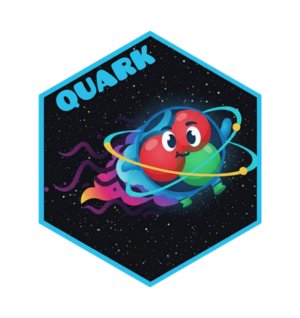

<!-- README.md is generated from README.Rmd. Please edit that file -->

```{r, include = FALSE}
knitr::opts_chunk$set(
  collapse = TRUE,
  comment = "#>",
  fig.path = "man/figures/README-",
  out.width = "100%"
)
```

# quark 

<!-- badges: start -->
<!-- badges: end -->

quark is an agentic machine learning interface.   

quark is built in R with [ellmer](https://ellmer.tidyverse.org) & leverages tools via [gluons](https://auto.gluon.ai) to produce an ideal AutoML framework.


## Installation (R Dependencies)

You can install the development version of quark like so:

``` r
devtools::install_github("frankiethull/quark")
```

## Setup (Python Dependencies)

note that quark is a [reticulated](https://rstudio.github.io/reticulate/) system & requires a python environment. The user can set these up like so:

```r
# 1) Create the virual env
quark::create_quark_env()

# 2) Use the env
quark::use_quark_env()

# 3) install packages
quark::install_quark_dependencies()
```


## Agentic ML Example

Once the dependencies are setup, the user can load the library & use the environment created above like so: 

### load dependencies 

```{r example}
library(quark)
quark::use_quark_env()
```


### an example of tabular machine learning handled by quark: 

quark will either take a full dataset or a training/testing dataset from your environment. Given quark some information about your task, and it will handle the training, test validation, and give you additional details. The fitted model and test predictions are also returned to the user. 

#### dataset of interest 

We're splitting mtcars into two unique datasets to ask quark to create a model with training data & validate on test. 
```{r}
# add training and testing data to my environment
mtcars <- datasets::mtcars
mtcars_train <- mtcars |> head(20)
mtcars_test <- mtcars |> tail(5)
```

#### LLM & LLM provider  

For this example, we'll use a small language model hosted locally via ollama. mistral-nemo is a small model familiar with tools, same as gpt-oss. *(note: tools are required for quark.)*
```{r}
provider <- "ollama"
llm <- "mistral-nemo"
```

#### quark agent summary, fitted model, & predictions

Below showcases the results from quark after asking it to create a model for us. quark "flavor" defaults to "concise" but "detailed" is also supported.

##### mistral-nemo   
```{r}
 
question <- "please use 'mtcars_train' as training data and 'mtcars_test' as testing data and run the tabular module. I want to predict 'mpg'."

agent_fit_and_preds <- chat_quark(
  provider = provider, 
  model = llm, 
  prompt = question,
  flavor = "concise"
  )

agent_fit_and_preds$agent_summary
```
    
##### gpt-oss   
```{r}
 
provider <- "ollama"
llm <- "gpt-oss:20b"


question <- "please take 'mtcars' from my enviroment, split, summarize, and run the tabular module. I want to predict 'mpg'."

agent_fit_and_preds <- chat_quark(
  provider = provider, 
  model = llm, 
  prompt = question,
  flavor = "detailed"
  )

agent_fit_and_preds$agent_summary
```

